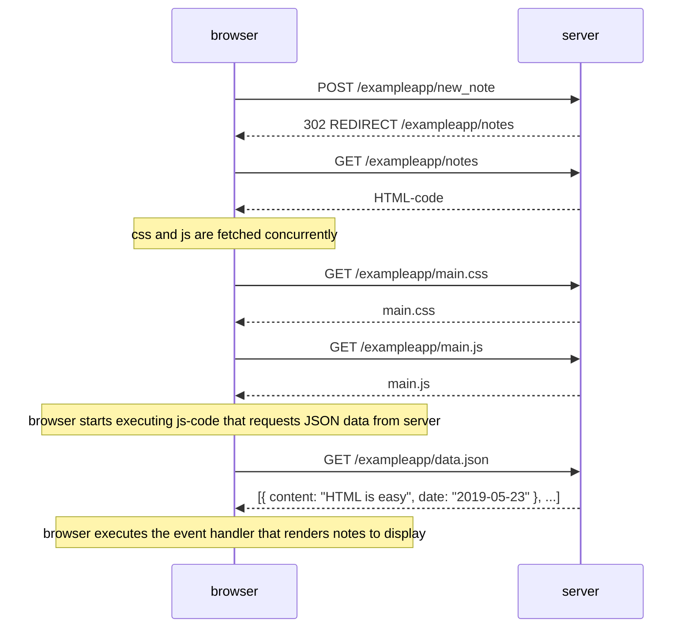
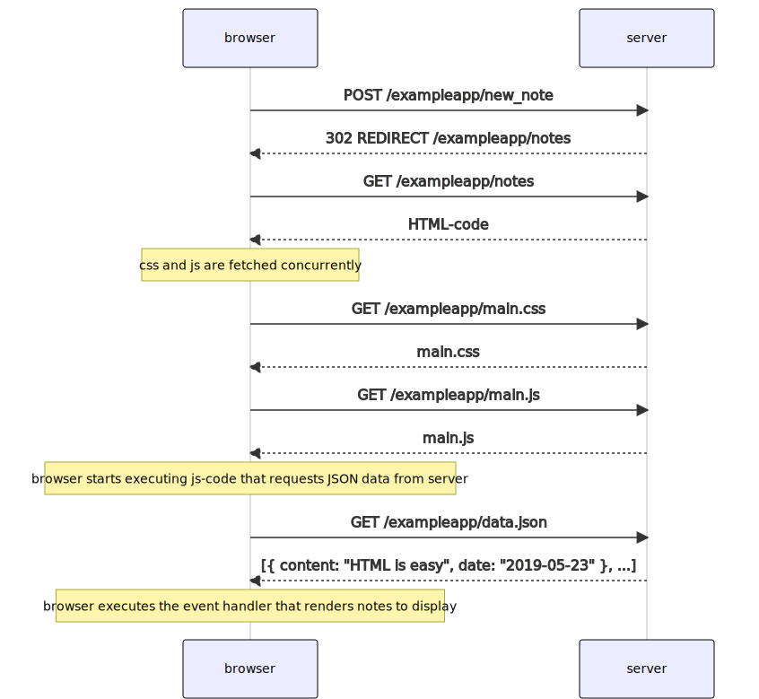
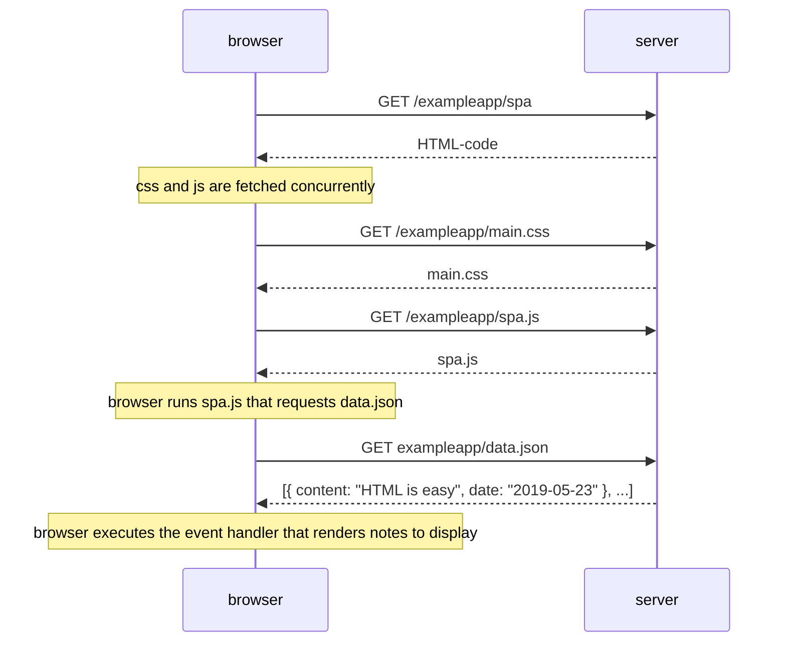
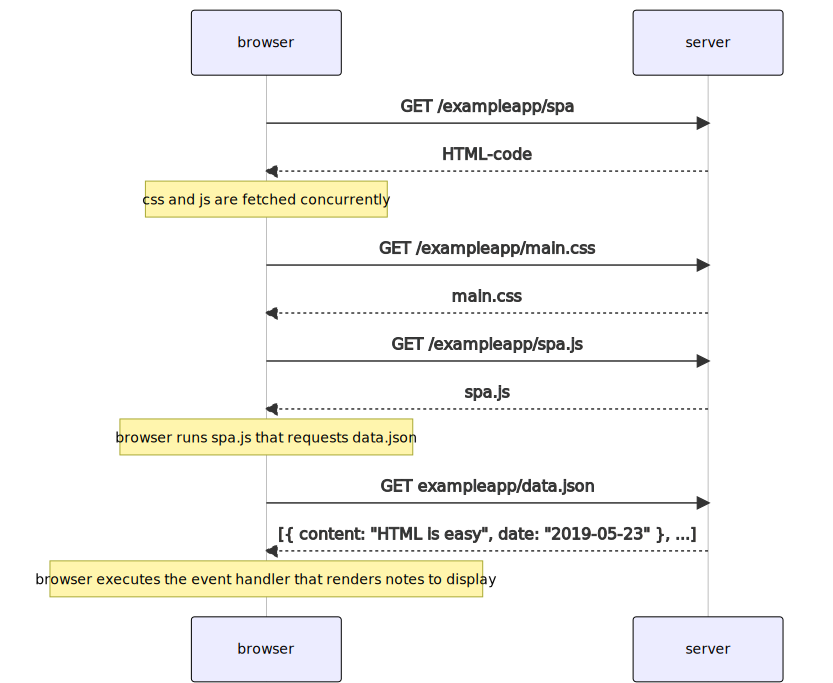
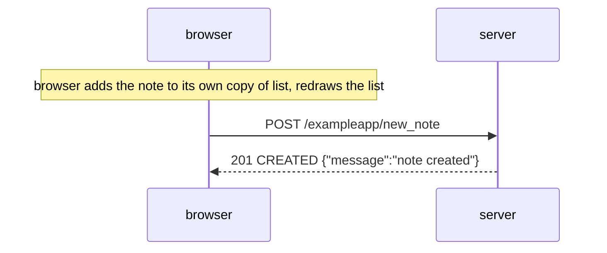
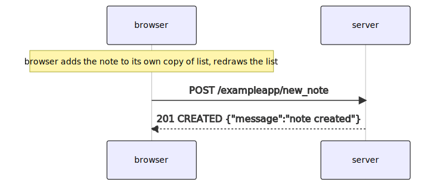

# Part 0

## [HTML](https://developer.mozilla.org/en-US/docs/Learn/Getting_started_with_the_web/HTML_basics)

## [CSS](https://developer.mozilla.org/en-US/docs/Learn/Getting_started_with_the_web/CSS_basics)

## [Forms](https://developer.mozilla.org/en-US/docs/Learn/HTML/Forms/Your_first_HTML_form)

## 4: POST /exampleapp/new_note

## 5: GET /exampleapp/spa

## 6 : POST /exampleapp/new_note

